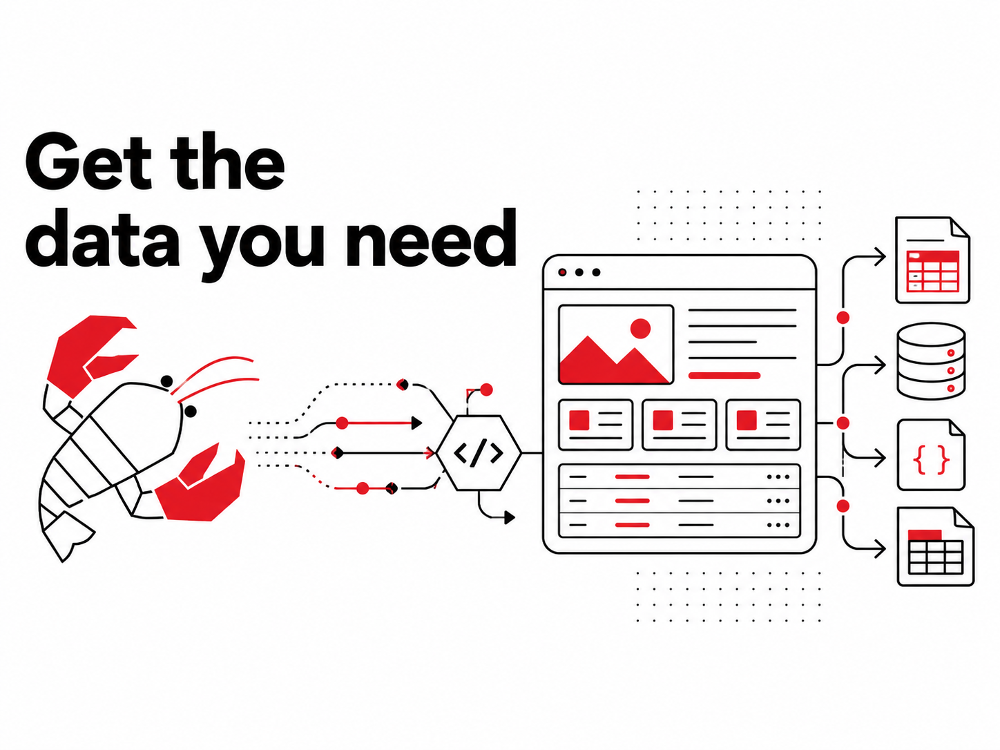

<br />
<p align="center">
    <a href="https://lobstr.io" target="_blank"></a>
</p>

<h1 align="center">Get the data you need</h1>

<p align="center">
    Thousands of companies of all sizes — from startups to large enterprises — use lobstr.io's software and APIs to collect data and automate repetitive actions online.
</p>

<p align="center">
  <a href="https://x.com/lobstrio"></a>
  <a href="https://www.linkedin.com/company/lobstrio/"></a>
  <a href="https://www.youtube.com/@lobstrio"></a>
</p>

<p align="center">
  <a href="https://lobstr.io/store"></a>
  <a href="https://docs.lobstr.io"></a>
  <a href="https://lobstr.io/blog"></a>
  <a href="https://help.lobstr.io"></a>
</p>

---

## Why lobstr.io ⚡

Building a scraper from scratch means handling proxies, captchas, account bans, exports, scheduling, and a dozen edge cases per platform. lobstr.io packages 50+ production-ready scrapers — we call them [Squids](https://help.lobstr.io/core-concepts/squids) — that already solve those problems, accessible from a no-code dashboard or programmatically via API, SDK, CLI, and MCP.

- **No-code dashboard *and* a full API.** Most platforms force a choice. Launch ad-hoc work from the UI in three clicks, then graduate to the SDK or CLI for production pipelines — same Squids, same data, same credit pool.
- **One-click account sync, no password sharing.** A browser add-on captures your cookies for LinkedIn, Sales Navigator, Facebook, Leboncoin, X/Twitter, and TikTok. lobstr.io scrapes through your authenticated session — credentials never leave your browser.
- **Built-in everything.** Rotating proxies on every plan, scheduling (every 5 minutes to weekly), multi-threaded runs (up to 20 parallel slots per Squid), Google Sheets / S3 / SFTP exports, Zapier and HubSpot integrations, and human support from the team that built it. No add-ons, no plugins.

---

## What you can scrape 🎯

**By source**

<p>
  <a href="https://lobstr.io/store"></a>
  <a href="https://lobstr.io/store"></a>
  <a href="https://lobstr.io/store"></a>
  <a href="https://lobstr.io/store"></a>
  <a href="https://lobstr.io/store"></a>
  <a href="https://lobstr.io/store"></a>
  <a href="https://lobstr.io/store"></a>
  <a href="https://lobstr.io/store"></a>
  <a href="https://lobstr.io/store"></a>
  <a href="https://lobstr.io/store"></a>
  <a href="https://lobstr.io/store"></a>
  <a href="https://lobstr.io/store"></a>
  <a href="https://lobstr.io/store"></a>
  <a href="https://lobstr.io/store"></a>
  <a href="https://lobstr.io/store"></a>
  <a href="https://lobstr.io/store"></a>
  <a href="https://lobstr.io/store"></a>
  <a href="https://lobstr.io/store"></a>
  <a href="https://lobstr.io/store"></a>
  <a href="https://lobstr.io/store"></a>
  <a href="https://lobstr.io/store"></a>
  <a href="https://lobstr.io/store"></a>
  <a href="https://lobstr.io/store"></a>
</p>

**By use case**

<p>
  <a href="https://lobstr.io/store"></a>
  <a href="https://lobstr.io/store"></a>
  <a href="https://lobstr.io/store"></a>
  <a href="https://lobstr.io/store"></a>
  <a href="https://lobstr.io/store"></a>
  <a href="https://lobstr.io/store"></a>
  <a href="https://lobstr.io/store"></a>
  <a href="https://lobstr.io/store"></a>
  <a href="https://lobstr.io/store"></a>
</p>

<br>

<p align="center">
  <a href="https://lobstr.io/store"></a>
</p>

---

## What teams build with lobstr.io 🏗️

- **Sales lead generation** — daily LinkedIn Sales Navigator scrapes piped into HubSpot, Salesforce, or a spreadsheet via the Make and Zapier integrations.
- **Local market research** — enumerate every restaurant, clinic, agency, or shop in a city with phone, email, hours, and ratings from Google Maps.
- **Real estate intelligence** — track new listings and price changes across SeLoger, Immoweb, Idealista, PAP, Realtor, and others on a schedule.
- **HR & talent analytics** — pull LinkedIn profiles and job listings for hiring pipelines and competitive workforce intelligence.
- **Reputation monitoring** — aggregate TripAdvisor, Trustpilot, and Yelp reviews into BI dashboards for brand teams.
- **Marketplace & price tracking** — monitor Vinted, Leboncoin, AutoScout24, and LaCentrale inventory and pricing in near-real-time.
- **Social listening** — pull YouTube channel analytics, Instagram profiles, TikTok content, Reddit threads, and X/Twitter activity for content and trend analysis.

---

## Learn about lobstr.io 🦞

<table>
  <tr>
    <td width="25%" align="center" valign="top">
      <h3>💳</h3>
      <a href="https://lobstr.io/pricing"><strong>Pricing</strong></a><br>
      <sub>Plan tiers and per-Squid rates.</sub>
    </td>
    <td width="25%" align="center" valign="top">
      <h3>🔌</h3>
      <a href="https://docs.lobstr.io"><strong>API & Docs</strong></a><br>
      <sub>Trigger scrapes programmatically.</sub>
    </td>
    <td width="25%" align="center" valign="top">
      <h3>📚</h3>
      <a href="https://help.lobstr.io"><strong>Help Center</strong></a><br>
      <sub>Guides, tutorials, and <a href="https://help.lobstr.io/core-concepts/squids">core concepts</a>.</sub>
    </td>
    <td width="25%" align="center" valign="top">
      <h3>✍️</h3>
      <a href="https://lobstr.io/blog"><strong>Blog</strong></a><br>
      <sub>Case studies and how-tos.</sub>
    </td>
  </tr>
</table>

---

## Developer tools 🛠️

Use the API, SDK, or CLI for production. Connect lobstr.io to AI agents via MCP. All four speak to the same backend as the dashboard.

### Python SDK

[](https://github.com/lobstrio/lobstrio-sdk)

```bash
pip install lobstrio-sdk
```

```python
from lobstrio import LobstrClient

# Token resolved from LOBSTR_TOKEN env var, then ~/.config/lobstr/config.toml
client = LobstrClient()

# Find the right crawler, create a Squid, run it, stream results
crawler = next(c for c in client.crawlers.list() if c.slug == "google-maps-leads-scraper")
squid = client.squids.create(crawler=crawler.id, name="Paris Restaurants")
client.tasks.add(squid=squid.id, tasks=[
    {"url": "https://google.com/maps/search/restaurants+paris"}
])

run = client.runs.wait(client.runs.start(squid=squid.id).id)
print(f"Done — {run.total_results} results, {run.credit_used} credits used")

for place in client.results.iter(squid=squid.id):
    print(place["name"], place.get("phone"))
```

[Full SDK docs →](https://docs.lobstr.io/docs/sdk)

### CLI

[](https://github.com/lobstrio/lobstrio-cli)

```bash
pip install lobstrio

lobstr crawlers search "google maps"
lobstr squid create google-maps-leads-scraper --name "Paris Restaurants"
lobstr task add SQUID_ID "https://google.com/maps/search/restaurants+paris"
lobstr run start SQUID_ID --wait
lobstr results get SQUID_ID --format csv -o results.csv
```

[Full CLI docs →](https://docs.lobstr.io/docs/cli)

### MCP server

Connect lobstr.io's docs MCP server to Claude, Cursor, or any MCP-compatible agent to query the help center and generate code from inside your AI assistant.

```bash
curl -X POST https://docs.lobstr.io/mcp \
  -H "Content-Type: application/json" \
  -H "Accept: application/json, text/event-stream" \
  -d '{
    "jsonrpc": "2.0",
    "method": "tools/call",
    "params": {
      "name": "search_lobstr_io",
      "arguments": { "query": "create squid" }
    },
    "id": 1
  }'
```

[Full MCP docs →](https://docs.lobstr.io/docs/mcp)

---

## Find us on

<p>
  <a href="https://www.g2.com/products/lobstr/reviews"></a>
  <a href="https://www.capterra.com/p/10018837/lobstr/"></a>
  <a href="https://www.make.com/en/integrations/lobstr"></a>
</p>

---

<div align="center">
  <p>
    <strong>Get the data you need.</strong><br>
    <a href="https://lobstr.io/store">Browse the Store</a> · <a href="https://docs.lobstr.io">Read the docs</a> · <a href="https://help.lobstr.io">Help Center</a>
  </p>
  <br>
  <sub>Made in Paris 🇫🇷 by the lobstr.io team.</sub>
</div>
